<p align="center">
  
</p>

<h1 align="center">Zekura</h1>

<p align="center">
  <strong>A confidential decentralized exchange built on Midnight.</strong><br/>
  Orders are committed on-chain, matched off-chain, and settled on-chain — without ever revealing asset, amount, side, price, or owner identity to a public observer.
</p>

<p align="center">
  <a href="https://github.com/wolf1276/ZEKURA/actions/workflows/ci.yml"></a>
  <a href="./LICENSE"></a>
  <a href="https://docs.midnight.network/"></a>
  <a href="./contracts/exchange.compact"></a>
  <a href="./tsconfig.json"></a>
  <a href="./web/package.json"></a>
  <a href="./package.json"></a>
</p>

<p align="center">
  Zekura is a continuous limit-order exchange where the chain never learns what is being traded, at what price, or by whom — and the one off-chain party that must see order contents to match them is cryptographically prevented from acting as anyone's owner.
</p>

---

## Overview

Public order books leak information by construction: price, size, side, and
counterparty are visible to anyone watching the chain, which is exactly the
data a trader least wants exposed before a fill. Zekura removes that leak at
the protocol level rather than papering over it in the UI.

**What it is.** Zekura is a three-tier system — a Compact smart contract, an
off-chain matching engine ("the Matcher"), and a trading UI — that implements
a continuous, multi-party, multi-order limit-order exchange on
[Midnight](https://docs.midnight.network/), a data-protection blockchain that
lets applications prove facts about data with zero-knowledge proofs instead
of publishing the data itself.

**Why it exists.** Midnight's own example contracts demonstrate
commitment-then-reveal privacy for single-round mechanisms — a sealed-bid
auction, a bulletin board, a loan eligibility check. None of them show a
*continuously operating* market: orders created, cancelled, or matched at any
time, against any number of counterparties, with replay protection and a
persistent per-order state machine. Zekura exists to answer that specific
question: can a real limit-order exchange be built this way, and can the
off-chain matcher — the one party that legitimately needs to see order
contents to do its job — be structurally prevented from abusing that
knowledge? See ["Product mapping"](#product-mapping) below for the full
comparison against Midnight's official examples.

**What problem it solves.** On a transparent order book, anyone can watch a
large order arrive and front-run it, correlate wallets by trading pattern, or
infer a firm's strategy from its resting orders. Zekura's on-chain footprint
is a commitment (a hash) and a lifecycle state — nothing else. The order's
real contents exist only in the owner's wallet and, for the single instant
matching requires it, in the Matcher's off-chain database.

**How it differs from a traditional DEX.** A traditional on-chain order book
*is* the public order book — the contract stores price, size, and side
directly, because the contract itself is what matches orders. Zekura inverts
this: `exchange.compact` is a public **commitment registry**, never an order
book. It never sees, stores, or matches order contents. The confidential
order book lives entirely off-chain with the Matcher, which matches crossing
orders in memory and submits `settle()` transactions that only *prove* a
valid match occurred, without revealing why. The result is observable, not
just claimed: the Trade page's "Verify privacy on-chain" panel fetches an
order's actual live ledger record and shows it side by side with the order's
real private fields, so the public/private split is something you can click
and confirm.

Zekura is a full production candidate, not a demo: **284 automated tests**
across all three tiers, an independent security audit with one P0 finding
found and fixed (see [`AUDIT.md`](./AUDIT.md)), and live deployments
exercised end to end — including real settlement, real Treasury-backed
protocol fills, and rejected attacks — on two public Midnight networks (see
[`Deployment.md`](./Deployment.md)).

### Product mapping

Zekura does not map cleanly onto a single official Midnight example
contract — it composes patterns from several of them into one system:

| Pattern | Where Zekura uses it | Closest official reference |
|---|---|---|
| Commitment-then-reveal privacy | `createOrder` commits; contents are only ever disclosed off-chain | [Private Reserve Auction](https://docs.midnight.network/examples/contracts/private-reserve-auction) |
| DApp-specific pseudonymous identity (never a real wallet key) | `deriveOwnerId(secretKey)` | Private Reserve Auction's `getDappPubKey`; also the pattern Midnight's own `zk-loan`/`bboard` tutorials use |
| Witness-verified reveal against a stored commitment | `cancelOrder`/`settle` re-derive `persistentCommit` and assert equality | [ZK Loan DApp](https://docs.midnight.network/tutorials/zk-loan), [Bulletin board DApp](https://docs.midnight.network/tutorials/bboard) |
| Off-chain matching engine + on-chain settlement split | `matcher/` vs. `exchange.compact` | No single official example — closest ecosystem analogues are orderbook-DEX submissions in the Finance & DeFi category |

If a single closest official product proposal is required, **Sealed-Bid
Auction** is the right anchor to name — Zekura's authorization and
commitment-hiding design is a direct extension of that pattern's techniques.
But Zekura's actual mechanism (continuous limit-order matching across an
arbitrary number of open orders, rather than one sealed-bid round with one
reveal) exceeds what that example demonstrates. It is best described as
**"a Private Reserve Auction pattern, generalized from one sealed round to a
continuously operating order book."**

## Key Features

| Feature | What it means in Zekura |
|---|---|
| **Confidential Orders** | Asset, amount, side, price, owner, and expiry never touch the chain. Only a 32-byte commitment and a lifecycle state (`OPEN`/`FILLED`/`CANCELLED`/`EXPIRED`) are ever public. |
| **Commitment-Based Order Model** | Orders are created with `persistentCommit<OrderDetails>(details, blinding)`; every later action (cancel, expire, settle) must supply witnesses that recompute the identical commitment before the contract trusts them. |
| **Zero-Knowledge Settlement** | `settle()` takes no order data as arguments — it re-derives both orders' private details from witnesses and proves, in zero knowledge, that they satisfy the crossing rules, without disclosing the underlying values. |
| **Proactive Matching Engine** | The Matcher's price-time-priority engine runs only on order arrival or removal — no poller, no timer, no background scan — and matches in O(1)-bounded operations against a per-asset, per-side price ladder. |
| **Protocol-Owned Liquidity (PPM)** | When no user counterparty crosses, the Matcher falls back to the Proactive Market Maker, which fills the order out of the Treasury's real, deposited on-chain balance — never minted, never fabricated. See ["Proactive Market Maker (PPM)"](#proactive-market-maker-ppm). |
| **Non-Custodial** | Zekura never holds funds or private keys. Wallets sign and submit their own `createOrder`/`cancelOrder` transactions directly; the Matcher only ever submits `settle()`/`settleWithProtocol()` for orders it has independently verified against the chain. |
| **Wallet Agnostic** | Connects through the standard Midnight DApp Connector API. Any wallet extension that implements it is auto-discovered; 1AM and Lace are recognized by name today. |
| **Replay Protection** | Two independent layers: a one-way `OPEN → {FILLED, CANCELLED, EXPIRED}` state machine, and a `settledPairs` nullifier set — a matched pair can never settle twice. |
| **Midnight Native** | Written in [Compact](https://docs.midnight.network/compact), Midnight's zero-knowledge smart contract language, and integrated through the official `midnight-js-*` provider stack — no custom cryptography, no bridge, no side-chain. |
| **Open Source** | MIT-licensed, full source for the contract, matcher, and UI in this repository. |

## Live Demo

Zekura does not yet have a hosted public website, whitepaper, or demo video —
this section reports that honestly rather than link to something that
doesn't exist. What *is* live today:

| Resource | Link |
|---|---|
| Source code | [github.com/wolf1276/ZEKURA](https://github.com/wolf1276/ZEKURA) |
| Preview contract (Midnight testnet) | [`7e6fb224…52984`](https://preview.midnightexplorer.com/) on [Preview explorer](https://preview.midnightexplorer.com/) |
| Preprod contract (Midnight testnet, default network) | [`7d1f1f67…7eb9d1`](https://preprod.midnightexplorer.com/) on [Preprod explorer](https://preprod.midnightexplorer.com/) |
| Security audit | [`AUDIT.md`](./AUDIT.md) |
| Deployment & live-verification record | [`Deployment.md`](./Deployment.md) |
| X (Twitter) | [@zekuraprotcol](https://x.com/zekuraprotcol) |
| Whitepaper / hosted app | Not published yet — see ["Roadmap"](#roadmap) |

To run the full stack yourself against either live testnet, see
["Getting Started"](#getting-started) and ["Wallet Setup"](#wallet-setup).

## Screenshots

Captured from a real `next dev` build running against live Preprod (headless
Chromium, no wallet connected — the pre-connect / empty state every visitor
sees first). The navbar's "Preprod" badge on every page confirms the app's
default network. See ["Demo Instructions"](#getting-started) to drive a
connected-wallet session yourself.

<table>
<tr>
<td align="center"><b>Landing</b><br/>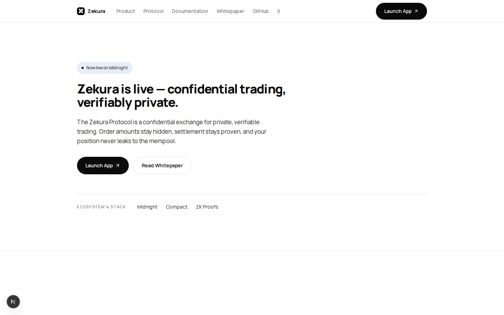</td>
<td align="center"><b>Overview / Dashboard</b><br/>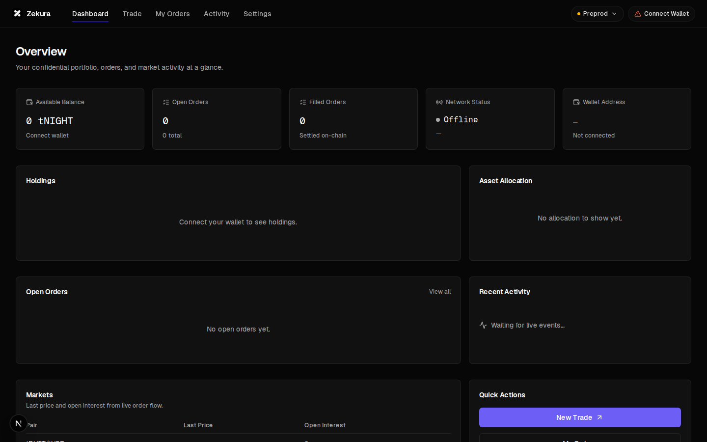</td>
</tr>
<tr>
<td align="center"><b>Trade</b><br/>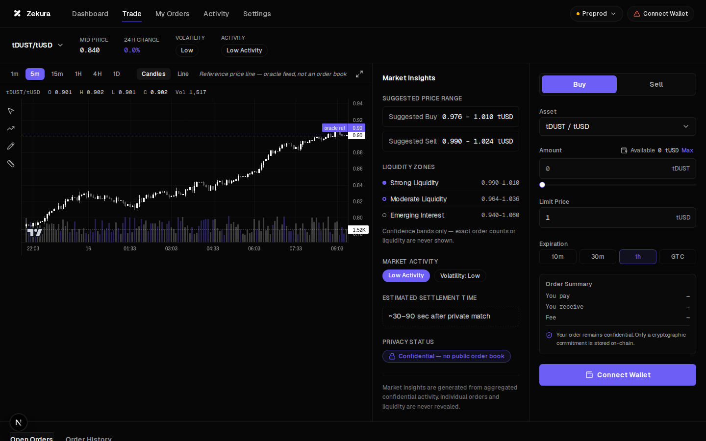</td>
<td align="center"><b>My Orders</b><br/>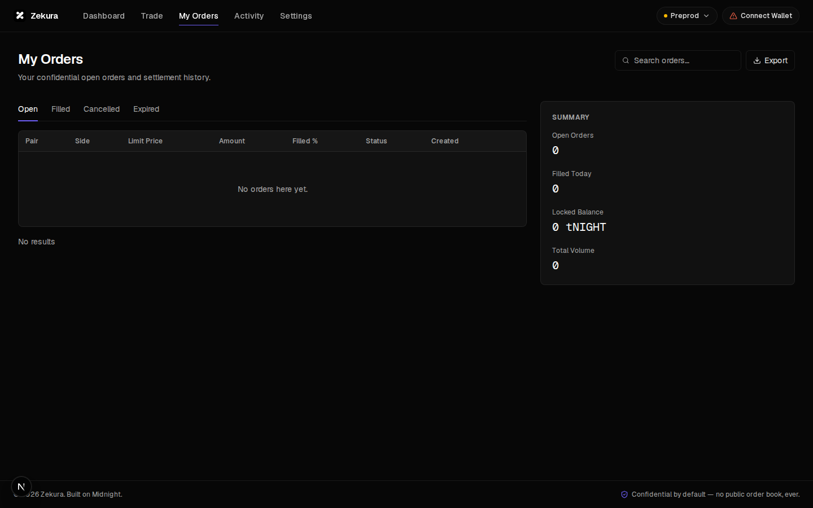</td>
</tr>
<tr>
<td align="center" colspan="2"><b>Activity</b><br/>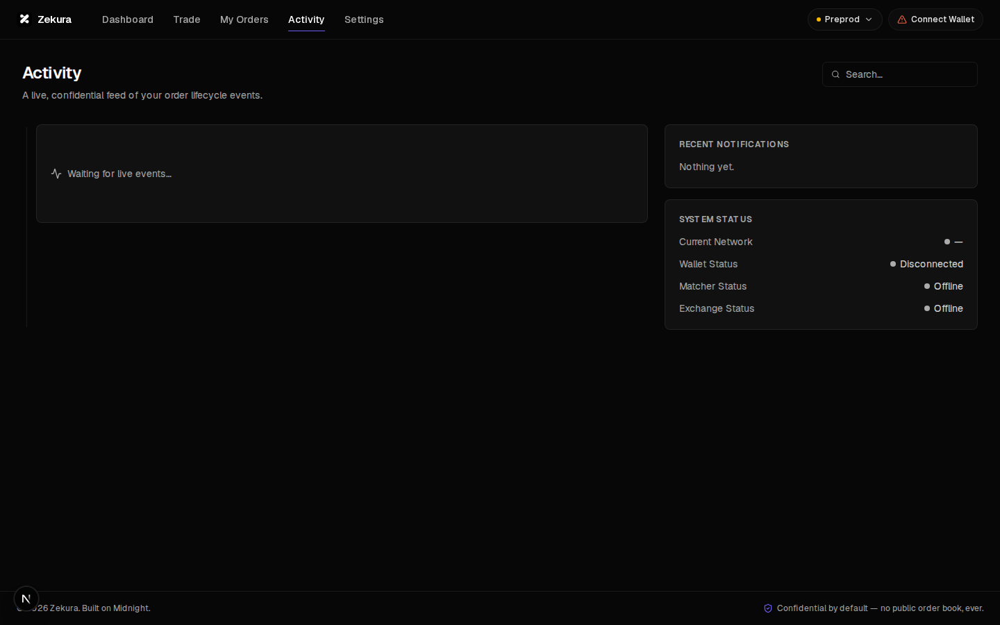</td>
</tr>
</table>

> The Settings page exists in the app (`web/src/app/settings`) but was not
> captured in this pass. Architecture is documented as diagrams in the next
> section rather than a screenshot.

## Table of Contents

- [Overview](#overview)
- [Key Features](#key-features)
- [Live Demo](#live-demo)
- [Screenshots](#screenshots)
- [Architecture Overview](#architecture-overview)
- [How It Works](#how-it-works)
- [Proactive Market Maker (PPM)](#proactive-market-maker-ppm)
- [Treasury](#treasury)
- [Privacy Model](#privacy-model)
- [Technology Stack](#technology-stack)
- [Repository Structure](#repository-structure)
- [Getting Started](#getting-started)
- [Wallet Setup](#wallet-setup)
- [Running the Matcher](#running-the-matcher)
- [Smart Contracts](#smart-contracts)
- [Testing](#testing)
- [CI/CD](#cicd)
- [Security](#security)
- [Performance](#performance)
- [Roadmap](#roadmap)
- [Contributing](#contributing)
- [Documentation](#documentation)
- [FAQ](#faq)
- [License](#license)
- [Acknowledgements](#acknowledgements)

## Architecture Overview

Zekura has five moving parts: the **frontend** (wallet-facing UI), the
**wallet layer** (the user's own extension plus a local proof server), the
**Matcher** (confidential order book, matching engine, and settlement
submitter — which also embeds the **PPM**, the Matcher's fallback liquidity
component), the **Treasury** (the contract's own protocol-owned liquidity
ledger), and the **exchange contract** (public commitment registry +
settlement + Treasury accounting). A **Network Manager** inside the frontend
keeps all of them pointed at the same Midnight network.

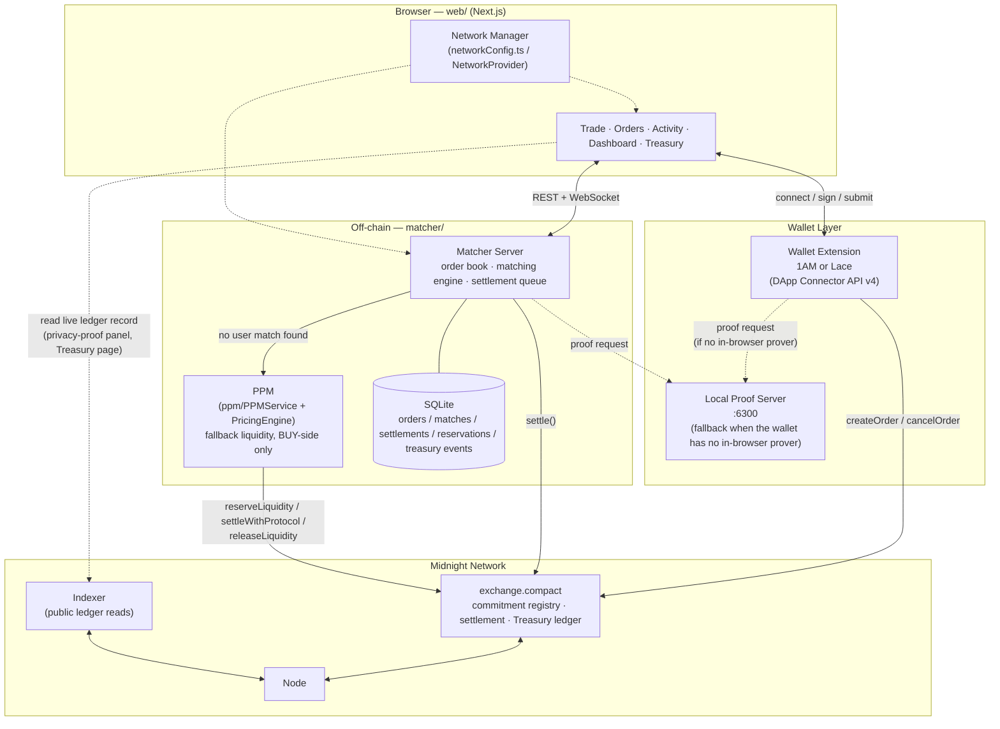

**Frontend (`web/`).** A Next.js app that never itself holds keys or proves
anything — it delegates signing and proving to the connected wallet
extension, and reads/writes order state through the Matcher's REST/WebSocket
API. See [`web/src/services/midnight/exchangeContract.ts`](./web/src/services/midnight/exchangeContract.ts)
for the direct contract calls and [`web/src/services/matcher/matcherClient.ts`](./web/src/services/matcher/matcherClient.ts)
for the Matcher client. The `/treasury` route (`web/src/components/treasury/treasury-page.tsx`)
reads live Treasury balance/reservation/risk data and, for allowlisted admin
wallets, exposes the deposit/withdraw funding UI.

**Wallet Layer.** Any Midnight DApp-Connector-compatible extension. 1AM
implements in-browser proving; Lace does not, so the app falls back to a
local proof server for Lace sessions only. See ["Wallet Setup"](#wallet-setup).

**Matcher (`matcher/`).** A standalone Fastify server that owns the actual
confidential order book. It receives full order details off-chain (after the
wallet has already registered the order's commitment on-chain itself),
independently re-verifies that disclosure against the live indexer, matches
crossing orders in memory, and submits `settle()`. When no user counterparty
crosses, it hands the resting order to its embedded **PPM** component
(`matcher/src/ppm/`) as a fallback liquidity provider — see
["Proactive Market Maker (PPM)"](#proactive-market-maker-ppm). See
[`matcher/ARCHITECTURE.md`](./matcher/ARCHITECTURE.md) for the full request
flow and database schema.

**Treasury.** The contract's own protocol-owned liquidity ledger
(`treasuryBalances`/`treasuryReserved`/`reservations`/`treasuryHistory` in
`contracts/exchange.compact`) — funded only by real admin deposits, never
minted. See ["Treasury"](#treasury).

**Exchange Contract (`contracts/exchange.compact`).** The sole source of
truth on-chain. 13 exported circuits plus 3 exported pure circuits, admin
role gated to Treasury funding only (order creation/cancellation/settlement
remain permissionless/owner-authorized, unchanged) — see
["Smart Contracts"](#smart-contracts).

**Network Manager.** `web/src/network/networkConfig.ts` is the single source
of truth for every network Zekura supports (`preview`, `preprod` today).
Critically, the app does **not** choose the active network itself at
runtime — it adopts whatever network the connected wallet reports, since the
DApp Connector's own guidance is that DApps should follow the wallet's
configuration.

**Settlement flow.** See the sequence diagram in ["How It Works"](#how-it-works)
below.

## How It Works

### Matching & fallback flow

The Matcher always tries a user counterparty first; the PPM is invoked only
when the private order book has no crossing order, and acts as a fallback
liquidity provider rather than the primary execution engine:

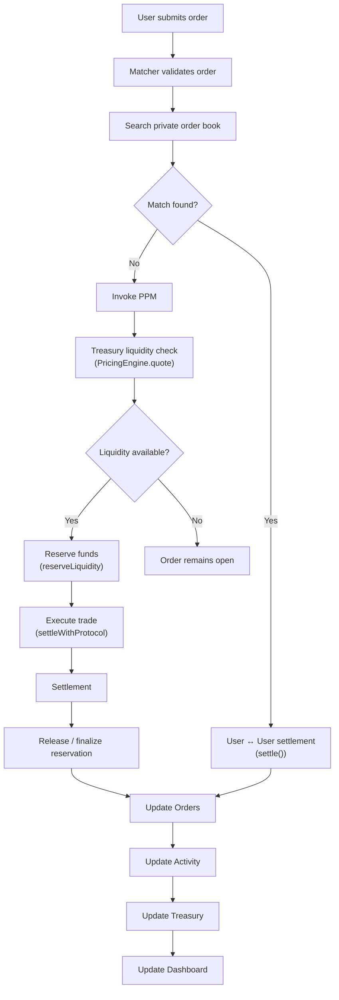

If `settleWithProtocol` itself fails after a reservation was taken, the
Matcher best-effort releases that reservation back to available liquidity
immediately (`PPMService.attemptFill`'s catch path) rather than leaving it
stuck until expiry; a still-open reservation past its `expiresAt` is
reclaimed by `releaseExpiredLiquidity`, which is permissionless and swept
periodically by the Matcher (`PPMService.sweepExpiredReservations`) as
defense in depth. See ["Proactive Market Maker (PPM)"](#proactive-market-maker-ppm)
for what "liquidity available" actually checks.

### Order lifecycle, user↔user case

The full lifecycle — **wallet → commitment → Matcher → settlement → ledger →
UI updates** — for one order that gets matched against another user:

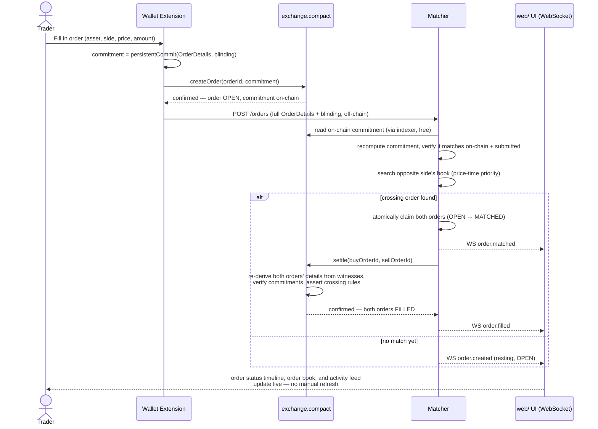

Two properties make this safe without a trusted intermediary:

1. **The Matcher cannot forge disclosure.** `OrderService.submitOrder`
   recomputes the commitment from the disclosed `OrderDetails` and requires
   it to equal *both* the client-supplied commitment *and* the one already
   recorded on-chain — a party that doesn't actually know an order's true
   contents cannot get it accepted into the book.
2. **The Matcher cannot cancel an order it merely knows about.** `settle()`'s
   witnesses never include `ownerSecretKey` — that witness is exclusive to
   `cancelOrder`, and the Matcher never holds one. See
   ["Privacy Model"](#privacy-model) for why this specific boundary needed a
   dedicated audit fix.

## Proactive Market Maker (PPM)

The PPM is **protocol-owned liquidity**, not a second matching engine and not
a market-making bot with its own capital. It is the Matcher's fallback path
(`matcher/src/ppm/PPMService.ts`) for the one case user↔user matching can't
solve: a resting order with no crossing counterparty yet.

- **Liquidity comes entirely from the Treasury.** Every unit the PPM ever
  quotes or settles is a real balance already sitting in the contract's
  `treasuryBalances` map — see ["Treasury"](#treasury).
- **The PPM never mints assets and never creates fake liquidity.** `PricingEngine.quote`
  (`matcher/src/ppm/PricingEngine.ts`) returns `null` — no quote at all —
  whenever the requested amount exceeds the Treasury's currently *available*
  balance (`balance − reserved`) or its configured per-quote risk limit
  (`maxExposureFraction`, 20% of available liquidity by default). There is no
  code path that fabricates a fill the Treasury can't actually back.
- **The PPM only uses real deposited funds.** The only way `treasuryBalances`
  becomes non-zero is an admin's `depositTreasury()` call actually pulling
  tokens into the contract via `receiveUnshielded` — see ["Treasury"](#treasury).
- **The Matcher decides whether a user match exists before invoking the
  PPM.** `OrderService.submitOrder` runs `MatchingEngine.onOrderArrived`
  first; the PPM is only called in the `no match` branch, exactly matching
  the flow in ["How It Works"](#how-it-works).
- **The PPM only executes when there is no suitable counterparty** — and even
  then, only when the order's own limit price actually crosses the PPM's
  quoted price (the same `buyPrice >= sellPrice`-style crossing check
  `settle()` uses between two user orders, applied against the PPM's single
  quote instead of a second order).
- **Treasury liquidity is reserved before execution and released or settled
  afterward.** A fill is always `reserveLiquidity()` → `settleWithProtocol()`,
  never a direct debit — see the reserve/execute/release lifecycle in
  ["Treasury"](#treasury) and the flowchart above.
- **Settlement always occurs on-chain.** `settleWithProtocol` is a real
  `exchange.compact` circuit; there is no off-chain-only "protocol fill" —
  every PPM execution has a real transaction id, exactly like `settle()`.

### MVP limitation: BUY-side only

| | User ↔ User matching | PPM (protocol liquidity) |
|---|---|---|
| BUY | ✅ | ✅ |
| SELL | ✅ | ❌ (disabled) |

`settleWithProtocol`'s SELL-side branch requires the Treasury to *receive*
the traded asset from the seller (`receiveUnshielded`) as part of the same
transaction — but every Treasury/PPM on-chain call is submitted by the
Matcher's own single operator wallet, which never custodies user funds and
has no escrow or co-signing mechanism for a user to supply that asset as a
transaction input. Attempting it would either fail outright or, worse,
silently debit the operator wallet's own balance while marking the user's
sell order `FILLED` without ever taking their asset.

`PPMService.attemptFill` declines every SELL order up front
(`"Protocol liquidity fills are only available for buy orders."`) and lets it
rest OPEN for a user counterparty exactly as if no PPM existed. **This is an
explicit MVP design decision, not a bug** — closing it requires a secure
multi-asset custody/escrow leg for the Treasury to receive a user's asset,
which is intentionally out of scope until that's built (see
["Roadmap"](#roadmap)).

## Treasury

The Treasury is the contract's own protocol-owned liquidity pool — the
on-chain state the PPM draws on. It has no relationship to any user's funds;
Zekura remains non-custodial for trading (see ["Privacy Model"](#privacy-model)).

- **The Treasury begins empty.** `treasuryBalances`/`treasuryReserved` are
  ledger `Map`s with no seeded entries — a never-funded asset simply reads as
  `0` (`balanceOf`/`reservedOf`'s member-check helpers), not an error.
- **The Treasury is funded only through real deposits.** `depositTreasury(assetKey, amount)`
  is the *only* circuit that increases `treasuryBalances` — it pulls real
  tokens into the contract's own custody via `receiveUnshielded` and is
  gated to an allowlisted admin (`requireAdmin()`, checking
  `deriveAdminId(adminSecretKey())` against the on-chain `admins` set).
- **Treasury backs protocol liquidity.** Everything the PPM ever quotes comes
  out of this same balance — see ["Proactive Market Maker (PPM)"](#proactive-market-maker-ppm).
- **Deposits increase available liquidity; reservations temporarily reduce
  it.** "Available" is always `balance − reserved`, computed live by
  `PricingEngine`/`OnChainTreasuryReader`, never a separately-tracked number
  that could drift.
- **Settlement finalizes accounting.** `settleWithProtocol` moves the
  reserved amount out of `treasuryReserved` (BUY side: pays the buyer via
  `sendUnshielded`) and marks the reservation `EXECUTED` — the same
  reserve → finalize shape `reserveLiquidity`/`releaseLiquidity` already
  establish.
- **Withdrawals return unused Treasury funds.** `withdrawTreasury` is
  admin-gated and explicitly can't touch anything currently reserved
  (`amount + reserved <= balance`) — liquidity held against an open PPM quote
  can never be pulled out from under it.
- **Treasury health metrics reflect protocol liquidity in real time.** The
  Matcher's `GET /ppm/status` and the web `/treasury` page compute a coarse
  `empty`/`healthy`/`elevated`/`critical` risk label directly from live
  `balance`/`reserved` (via `PricingEngine`'s inventory-skew utilization,
  mirrored in `matcher/src/api/treasury.ts`'s `riskStatus`) — never a cached
  or stale snapshot.

### Reservation lifecycle

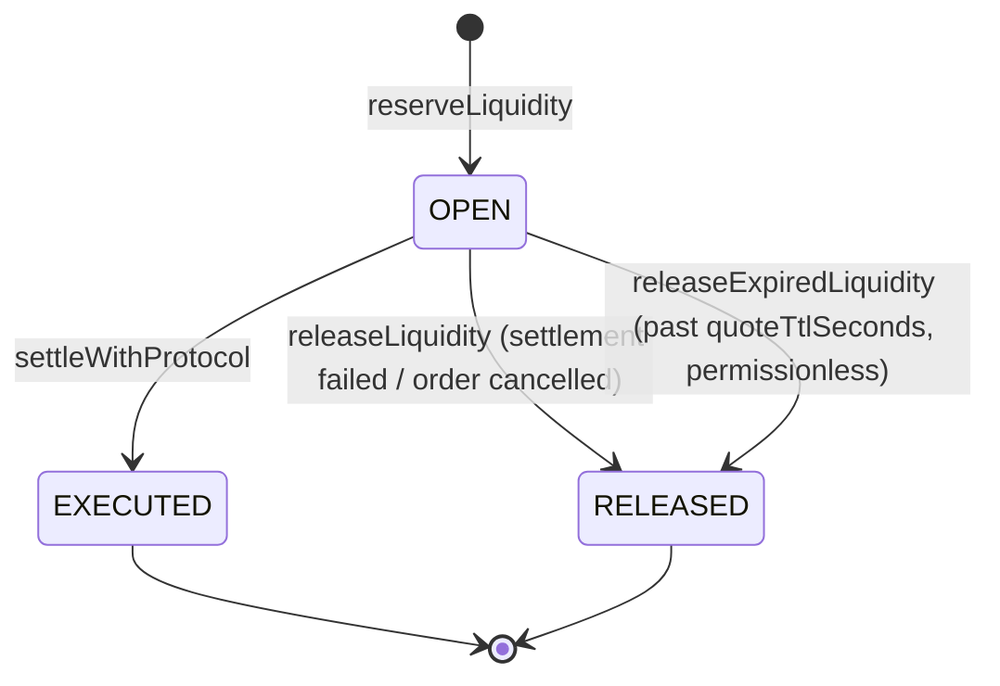

## Privacy Model

The contract's only on-chain state is the `orders` ledger — a
`Map<orderId, {commitment, state}>` — plus a replay-protection set
(`settledPairs`) and an append-only event log (`eventLog`) that carries only
`{kind, orderId}`. Everything else about an order lives off-chain, in the
owner's wallet and (once disclosed for settlement) the Matcher's database.

### What remains confidential

Never written to the ledger, never leaves the owner's wallet except to
whoever they explicitly disclose it to (the Matcher, off-chain, for
settlement):

| Field | Description |
|---|---|
| `asset` | Which token/pair the order trades |
| `amount` | Order size |
| `side` (`isBuy`) | Buy or sell |
| `owner` | A DApp-specific pseudonymous identity (`deriveOwnerId(secret)`) — never the caller's real Zswap public key or wallet address |
| `price` | Limit price |
| `expiresAt` | Order expiry (except indirectly, via the public fact that an `expireOrder()` call succeeded) |

### What observers can learn

Anyone reading the public ledger, an indexer, or a submitted transaction can see:

- That an order with a given `orderId` **exists**, and its 32-byte
  **commitment** (a hash — reveals nothing about its contents without the
  preimage).
- Its **lifecycle state** (`OPEN`/`FILLED`/`CANCELLED`/`EXPIRED`) and the
  order of state transitions.
- That a `createOrder`/`cancelOrder`/`settle`/`expireOrder` transaction was
  submitted, by which address, at which block — standard Midnight
  transaction metadata is not hidden by this contract.
- The **total count** of orders and their commitments (the `orders` map is
  fully enumerable), letting an observer infer overall order *count* — but
  not size, price, or side.

### What validators learn

Validators verify a zero-knowledge proof that a circuit call satisfies the
contract's rules, and apply the resulting public-state transcript — the same
`{orderId → commitment, state}` update any other observer would eventually
see via the indexer. Validators never see the private witnesses
(`OrderDetails`, `orderBlinding`, `ownerSecretKey`) that produced the proof;
Midnight's zk-SNARK verification confirms the proof is valid without
re-executing the private computation that generated it.

### What the Matcher learns

The Matcher is legitimately disclosed a submitting order's **full**
`OrderDetails` and blinding factor off-chain — it cannot match or settle
orders without them. It is explicitly **not** trusted with an order's
`ownerSecretKey`: `settle()`'s witness set never calls that witness, so the
Matcher structurally cannot satisfy `cancelOrder`'s owner check for any order
it merely knows the contents of. This boundary is why `DELETE /orders/:id`
on the Matcher's API can only remove an order from its own book/database —
it can never submit an on-chain `cancelOrder()`.

### Selective disclosure

A wallet creates an order by committing to its private details
(`persistentCommit<OrderDetails>(details, blinding)`) and submitting only the
resulting 32-byte `commitment` on-chain via `createOrder` — nothing about the
order's contents is revealed at creation time. To cancel, the owner's wallet
supplies the *same* private details and blinding factor back to the
`cancelOrder` circuit as witnesses; the circuit recomputes the commitment and
checks it against the one on record, proving knowledge without ever writing
the contents to the chain. Disclosure to the Matcher is a separate, explicit,
off-chain act by the owner's wallet (`POST /orders`) — never something the
contract or the Matcher can compel.

### Trust assumptions and threat model

| Actor | Trusted for | Not trusted for |
|---|---|---|
| Order owner's wallet | Its own `OrderDetails`, blinding factor, and `ownerSecretKey`. The only party able to `cancelOrder` its own orders, and the only party that submits `createOrder`/`cancelOrder` on-chain. | Nothing about other orders. |
| Matcher (off-chain) | Disclosed full `OrderDetails` + blinding for orders it is settling (required to call `settle`). Its own funded operator wallet, distinct from any user's. | Any order's `ownerSecretKey` — structurally never disclosed to it. Cannot cancel orders it did not create. |
| Any network observer | Can read all public ledger state (`orders`, `settledPairs`, `eventLog`) and submit any transaction. | Cannot forge a commitment preimage or a caller's `ownerSecretKey`/`orderBlinding` (never on-chain). |
| The prover (any caller's own frontend) | Controls every witness return value for its own calls. | Must never be trusted as an authorization signal by itself without a cryptographic binding — this is the general form of the audit's P0 finding (see ["Security"](#security)). |

A network observer cannot reconstruct the order book, cannot see who is
trading what against whom, and cannot correlate two orders as belonging to
the same owner (the owner field is a domain-separated hash of a per-DApp
secret, not a reusable public key).

**Observable, not just documented:** once an order is submitted through the
web app, the Trade page's "Verify privacy on-chain" panel
([`orderVerification.ts`](./web/src/services/midnight/orderVerification.ts) +
[`privacy-proof-panel.tsx`](./web/src/components/trade/privacy-proof-panel.tsx))
fetches that order's *actual* live ledger record from the connected
network's indexer and shows it side by side with the order's real private
fields the app already holds locally.

## Technology Stack

| Layer | Technology |
|---|---|
| **Smart contract language** | [Compact](https://docs.midnight.network/compact) `0.31.1` (compiler), language version `0.23.0` (pragma requires `>= 0.16`), runtime `0.16.0` — [`contracts/exchange.compact`](./contracts/exchange.compact) |
| **Contract tooling** | `@midnight-ntwrk/compact-js`, `@midnight-ntwrk/compact-runtime` (in-memory circuit execution for tests), `midnight-js-contracts` / `midnight-js-*` providers (deployment, indexer, proof, wallet plumbing) |
| **Matcher backend** | Node.js ≥ 22, TypeScript, [Fastify](https://fastify.dev/) (REST), [`ws`](https://github.com/websockets/ws) (WebSocket broadcast), [Zod](https://zod.dev/) (validation), [pino](https://getpino.io/) (structured logging) |
| **Matcher persistence** | [`better-sqlite3`](https://github.com/WiseLibs/better-sqlite3) — synchronous SQLite, used for atomic claim transactions |
| **Frontend framework** | [Next.js](https://nextjs.org/) `16.2.10` (App Router), [React](https://react.dev/) `19.2.4` |
| **Frontend UI** | Tailwind CSS 4, [shadcn/ui](https://ui.shadcn.com/) + Radix primitives, `lucide-react`, `framer-motion`, `sonner` (toasts), `lightweight-charts` (trading chart) |
| **Wallet integration** | `@midnight-ntwrk/dapp-connector-api` — the standard interface every Midnight-compatible wallet extension implements |
| **Database** | SQLite (Matcher's `orders`/`matches`/`settlements` tables) — the Matcher's local system of record; the chain itself stores no order data |
| **Testing** | [Vitest](https://vitest.dev/) (matcher, web); a hand-rolled assertion runner exercising compiled circuits directly via `@midnight-ntwrk/compact-runtime` (contract) |
| **Infrastructure** | Docker Compose — local devnet (`midnight-node`, `indexer-standalone`, `proof-server`) for local development; a standalone proof server for Preview/Preprod |
| **CI** | GitHub Actions ([`.github/workflows/ci.yml`](./.github/workflows/ci.yml)) |

## Repository Structure

```
zekura/
├── contracts/
│   ├── exchange.compact          # The sole production contract — commitment registry + settlement
│   └── managed/exchange/         # Compiled output of `npm run compile` (circuits, keys, zkir, TS bindings)
├── matcher/                      # Off-chain confidential order book + settlement engine (npm workspace)
│   ├── src/
│   │   ├── api/                  # Fastify REST routes — validate, delegate, serialize
│   │   ├── orderbook/            # Pure in-memory order book (Bucket, AssetBook, OrderBook) — no I/O
│   │   ├── matcher/              # Matching engine + price-time-priority strategy — no I/O
│   │   ├── ppm/                  # PPM fallback: PPMService (reserve/settle orchestration), PricingEngine (quoting), TreasuryClient (Treasury circuit access)
│   │   ├── db/                   # better-sqlite3 schema + repositories — orders/matches/settlements/reservations/treasury events, the system of record
│   │   ├── settlement/           # settle() client + retry queue
│   │   ├── websocket/            # SocketServer — WS event broadcast
│   │   ├── services/             # Orchestration: OrderService (matching + PPM fallback), SettlementService
│   │   ├── types/                # Domain types
│   │   ├── utils/                # Config, logging, Zod schemas, the commitment codec
│   │   ├── app.ts                # Fastify app factory — fully testable, deps injected
│   │   └── index.ts               # Composition root — the only file with real SDK wiring
│   ├── tests/                    # Mirrors src/, plus integration/ and concurrency/
│   ├── ARCHITECTURE.md           # Request flow, database schema, security & concurrency model
│   ├── API.md                    # Full REST/WebSocket reference
│   └── MATCHER.md                # Matching algorithm and settlement lifecycle
├── web/                          # Trading UI (standalone package, own lockfile)
│   └── src/
│       ├── app/                  # Next.js App Router routes (/, /trade, /orders, /activity, /dashboard, /treasury, /settings)
│       ├── components/           # Page and UI components, organized by feature (incl. treasury/)
│       ├── network/               # Network Manager — single source of truth for network config
│       ├── wallet/                 # DApp Connector integration, wallet discovery, connection lifecycle
│       ├── services/
│       │   ├── midnight/          # Direct contract calls, commitment codec, privacy verification
│       │   └── matcher/           # REST/WebSocket client for the Matcher API
│       ├── hooks/, lib/, types/, shims/
│       └── app/api/matcher/       # Same-origin proxy routes to the Matcher REST API
├── src/                          # Root-level CLI/deploy/setup scripts
│   ├── setup.ts                  # Compile + deploy in one step, with faucet-fund polling
│   ├── deploy.ts                 # Deploy the compiled contract
│   ├── cli.ts                    # Read-only CLI (look up an order, check balance)
│   ├── check-balance.ts, wallet.ts, wallet-state.ts, network.ts
├── scripts/
│   ├── e2e-check.ts               # Smoke check against a deployed contract
│   └── sync-retry.ts              # Wraps a command with sync-retry semantics
├── tests/
│   ├── exchange.test.ts           # Order registry + settlement test suite (34 tests) — drives compiled circuits directly
│   └── treasury.test.ts           # Treasury/PPM circuit test suite (26 tests) — deposit/withdraw/reserve/release/settleWithProtocol
├── docs/screenshots/              # README screenshots
├── docker-compose.yml            # Local devnet: node, indexer, proof server
├── AUDIT.md                       # Full security audit of the contract
├── Deployment.md                  # Deployment history and live end-to-end verification record
└── .github/workflows/ci.yml       # CI pipeline
```

## Getting Started

### Prerequisites

- **Node.js ≥ 22**
- **Docker** with Compose v2 (for the local devnet / local proof server)
- The **[Compact compiler](https://docs.midnight.network/getting-started/installation)**, pinned to the version this project targets:
  ```bash
  compact update 0.31.1
  ```
  (`compact --version` reports the CLI tool's own version — currently `0.5.1`
  — which is a different number from the compiler version above; both are
  documented in ["Smart Contracts"](#smart-contracts).)

### Installation

```bash
git clone https://github.com/wolf1276/ZEKURA.git zekura
cd zekura

npm install            # installs the root + matcher workspace (matcher is an npm workspace member)
cd web && npm install   # web is a standalone package with its own lockfile
```

### Environment variables

Copy `web/.env.example` to `web/.env.local` and fill in the network(s) you
intend to use:

| Variable | Default | Purpose |
|---|---|---|
| `NEXT_PUBLIC_EXCHANGE_CONTRACT_ADDRESS_PREVIEW` | *(none)* | This app's deployed `exchange.compact` address on Preview. Required to submit orders while on Preview — see the [Contract Address table](#smart-contracts). |
| `NEXT_PUBLIC_EXCHANGE_CONTRACT_ADDRESS_PREPROD` | *(none)* | Same, for Preprod — the app's default network. |
| `NEXT_PUBLIC_PROOF_SERVER_URL` | `http://127.0.0.1:6300` | Local proof server, used only when the connected wallet has no in-browser prover (e.g. Lace). |
| `NEXT_PUBLIC_MATCHER_WS_URL` | `ws://localhost:4000/ws` | Matcher WebSocket feed, called directly from the browser. |
| `MATCHER_API_URL` | `http://localhost:4000` | Matcher REST base URL, used server-side by the Next.js same-origin proxy routes (`app/api/matcher/**`). |
| `NEXT_PUBLIC_ADMIN_ADDRESSES` | *(none)* | Comma-separated unshielded wallet addresses that see the Treasury page's admin funding UI. Client-side hint only — the real authorization boundary is the Matcher's own `MATCHER_ADMIN_ADDRESSES` allowlist plus a real wallet signature. Should match (a subset of) `MATCHER_ADMIN_ADDRESSES`. |

The active network itself (Preview vs. Preprod) is **not** an env var — it's
chosen at runtime by whatever network the connected wallet reports. See
["Wallet Setup"](#wallet-setup).

### Development

```bash
# Terminal 1 — local proof server (only needed for local devnet or a wallet without in-browser proving)
docker compose up -d --wait proof-server

# Terminal 2 — Matcher
cd matcher && npm run dev

# Terminal 3 — web app
cd web && npm run dev
```

Open `http://localhost:3000`. By default the app targets **Preprod** — see
["Smart Contracts"](#smart-contracts) for the currently deployed addresses,
and ["Wallet Setup"](#wallet-setup) for connecting a wallet.

### Running locally against your own devnet

To run against a fully local network instead of a public testnet:

```bash
docker compose up -d --wait   # node, indexer, proof server — see docker-compose.yml
npm run setup                  # compiles the contract and deploys to the local devnet
```

`npm run setup` writes the deployed address to `.midnight-state.json`
(gitignored) and prints it to the console.

### A full trade, end to end

1. Start infrastructure (proof server, Matcher, web app) as above.
2. Connect a wallet (1AM or Lace) via the navbar.
3. Submit an order on the Trade page — this signs and submits a real
   `createOrder(orderId, commitment)` call through the connected wallet
   ([`exchangeContract.ts`](./web/src/services/midnight/exchangeContract.ts)),
   no mocks.
4. Watch it propagate live: the Trade page's status timeline, Orders,
   Activity, and Overview all update automatically from the same Matcher
   WebSocket feed — no manual refresh.
5. Use the "Verify privacy on-chain" panel to fetch the order's actual live
   ledger record and compare it against the private fields the app holds
   locally.
6. To see a match, repeat step 3 with a second, crossing order (opposite
   side, crossing price, same asset) from a second wallet/browser profile —
   the Matcher matches it against the resting order and submits `settle()`
   automatically.

## Wallet Setup

Zekura connects through the standard **Midnight DApp Connector API**
(`@midnight-ntwrk/dapp-connector-api` v4), the same interface every
Midnight-compatible wallet extension implements.

### Supported wallets

| Wallet | Injection key | Notes |
|---|---|---|
| **[1AM Wallet](https://1am.xyz/)** | `window.midnight['1am']` | Recommended. Shielded by default, implements in-browser proving (`getProvingProvider()`) — no local proof server required. |
| **[Lace](https://www.lace.io/midnight)** | `window.midnight.mnLace` | Does not implement `getProvingProvider()` — the app falls back to the local proof server (`NEXT_PUBLIC_PROOF_SERVER_URL`) for Lace sessions only. |
| Any other DApp-Connector-compatible wallet | *(any key under `window.midnight`)* | Auto-discovered generically — nothing about a new wallet needs to be known ahead of time. See [`walletRegistry.ts`](./web/src/wallet/walletRegistry.ts). |

### Connection lifecycle

Handled end to end by [`WalletProvider.tsx`](./web/src/wallet/WalletProvider.tsx):

- **Connect** — via the wallet picker modal; the `connect()` call happens
  synchronously inside the click so the extension's approval pop-up isn't
  blocked, with a generous timeout as a safety net against a hung extension.
- **Disconnect** — clears local session state and the "reconnect on load" flag.
- **Reconnect** — if the browser was previously connected, the same wallet
  is silently reconnected on page load once the Network Manager has settled
  on a network; a rejected/failed silent reconnect falls back to the manual
  picker without surfacing an error.
- **States** — `idle` / `connecting` / `connected` / `unsupported-network` /
  `disconnected` / `unavailable` / `error`, all modeled explicitly by
  `WalletStatus`. Connector failures are normalized into a `WalletError`
  with a user-facing message.

### Network selection

The DApp Connector v4 API has no push events for network changes, so the app
polls `getConnectionStatus()` and adopts whatever network the wallet
reports as its own — there is no separate "choose a network in the app"
control. `unsupported-network` fires only for a wallet-reported id Zekura
has no `NetworkConfig` for (i.e. anything other than `preview`/`preprod`).

### Troubleshooting

| Symptom | Likely cause |
|---|---|
| Wallet picker shows no installed wallets | The extension isn't injecting under a recognized key — confirm it implements the Midnight DApp Connector API and is enabled for the current site. |
| `unsupported-network` after connecting | The wallet is set to a network Zekura doesn't configure (only `preview`/`preprod` exist today — see ["Roadmap"](#roadmap) for Mainnet). |
| Order submission hangs at the approval pop-up | Using Lace without a running local proof server — start one with `docker compose up -d --wait proof-server` and confirm `NEXT_PUBLIC_PROOF_SERVER_URL` points at it. |
| "not deployed on this network" | `NEXT_PUBLIC_EXCHANGE_CONTRACT_ADDRESS_PREVIEW`/`_PREPROD` isn't set for the network the wallet is on — see the [Contract Address table](#smart-contracts). |

## Running the Matcher

The Matcher (`matcher/`) is an npm workspace member of the root package —
it shares `node_modules` and imports the root's `src/wallet.ts`/`src/network.ts`
and the compiled contract artifacts directly rather than duplicating them.

### Prerequisites

- Everything in ["Getting Started"](#getting-started) (Node ≥ 22, Docker, the Compact compiler).
- The exchange contract compiled (`npm run compile` at the repo root) and
  deployed to the network you intend to run against.
- A local proof server reachable at the target network's proof server URL.
- Its own funded operator wallet — **should be a distinct, independently
  funded wallet on Preview/Preprod**, not the contract deployer's.

### Start

```bash
cd matcher
npm run dev      # tsx watch — fast local iteration
npm run build    # real tsc build to dist/
npm start        # runs the build
```

> **Build output note:** because `index.ts` imports the root project's
> `src/wallet.ts`/`src/network.ts` directly, `tsc`'s inferred `rootDir` spans
> both `matcher/src` and the repo root's `src`. The compiled entry point
> lands at `dist/matcher/src/index.js`, not `dist/index.js` — this is what
> `npm start` runs.

By default the Matcher targets whatever network `.midnight-state.json`
(repo root) has active. Override with environment variables:

| Variable | Default | Purpose |
|---|---|---|
| `MATCHER_PORT` | `4000` | HTTP + WebSocket port |
| `MATCHER_HOST` | `0.0.0.0` | Bind address |
| `MATCHER_DB_PATH` | `./data/matcher.db` | SQLite file path (`:memory:` also works) |
| `MATCHER_LOG_LEVEL` | `info` | pino log level |
| `MATCHER_PRETTY_LOGS` | `true` outside `NODE_ENV=production` | Human-readable vs. structured JSON logs |
| `MATCHER_SETTLEMENT_MAX_RETRIES` | `5` | Transient-failure retry budget per settlement |
| `MATCHER_SETTLEMENT_RETRY_DELAY_MS` | `5000` | Linear backoff base delay |
| `MATCHER_WALLET_SEED` | falls back to the root project's per-network deployer seed | The Matcher's own operator wallet |
| `PRIVATE_STATE_PASSWORD` | local-devnet placeholder | Wallet private-state store password (≥16 chars) |

See [`matcher/README.md`](./matcher/README.md), [`matcher/ARCHITECTURE.md`](./matcher/ARCHITECTURE.md),
and [`matcher/API.md`](./matcher/API.md) for the full reference.

### API surface (summary)

| Method | Path | Purpose |
|---|---|---|
| `POST` | `/orders` | Disclose a signed order for matching/settlement |
| `DELETE` | `/orders/:id` | Remove an order from the Matcher's book (never on-chain) |
| `GET` | `/orders/:id` | Fetch one order |
| `GET` | `/orders/open` | All currently `OPEN` orders |
| `GET` | `/orderbook` | Aggregated bid/ask snapshot for one asset |
| `GET` | `/trades` | Recent fills for one asset |
| `GET` | `/stats` | Rolling-window price/volume stats |
| `GET` | `/health` | Liveness check |
| `GET` | `/treasury/balance` | Live Treasury balance/reserved/available for one asset (public — Treasury state is already public on-chain ledger data) |
| `GET` | `/treasury/history` | Recent Treasury events (`DEPOSIT`/`WITHDRAW`/`RESERVE`/`RELEASE`/`EXECUTE`) |
| `GET` | `/ppm/status` | Treasury liquidity plus a coarse `empty`/`healthy`/`elevated`/`critical` risk label and the active `PricingConfig` |
| `POST` | `/admin/challenge` | Issues a signed-nonce challenge to an allowlisted admin address (first step of `MATCHER_ADMIN_ADDRESSES` wallet-signature auth) |
| `POST` | `/admin/treasury/deposit` | Admin-only: submits a real `depositTreasury()` transaction |
| `POST` | `/admin/treasury/withdraw` | Admin-only: submits a real `withdrawTreasury()` transaction to a specified recipient |
| `WS` | `/ws` | Live event stream (`order.created`, `order.matched`, `order.settling`, `order.filled`, `order.failed`, `order.cancelled`, `order.expired`, `treasury.reserved`, `treasury.released`, `treasury.deposited`, `treasury.withdrawn`) |

Full request/response shapes, error codes, and the WebSocket message
contract are in [`matcher/API.md`](./matcher/API.md).

## Smart Contracts

### Contract addresses

| Network | Contract Address | Deployed |
|---|---|---|
| **Preview** | `7e6fb224e13e12736fdfbaed2d80265105f3a942a88d61a494472c5e11152984` (post-audit build) | 2026-07-15 |
| **Preprod** (default network) | `4e13ec7030611cbd35dcda657f75b7d0a2ae00dd7d59c8ab9facd225dd3e08fa` (NIGHT-payment-leg + SELL-PPM + deriveAssetKey fix, 12 circuits — see below and Deployment.md) | 2026-07-18 |
| **Preprod — tZKR token** | `461009399dcd6e196376c3e8d470f8ba801a1d0d9262ead39a0684f500f85f89` (`contracts/tzkr-token.compact`) | 2026-07-17 |
| Undeployed (local devnet) | not persistent — redeploy via `npm run setup` | — |

**The two networks currently run different builds.** Preprod runs the latest
contract (Treasury/PPM plus a real NIGHT payment leg on `settleWithProtocol`
and SELL-side PPM fills). Preview is **stale** — it still runs the
pre-Treasury 5-circuit build from 2026-07-15 and has none of the above;
redeploying it is tracked in ["Roadmap"](#roadmap). See
[`Deployment.md`](./Deployment.md) for the full deployment record (deployer
addresses, funding, and every verification pass) and [`AUDIT.md`](./AUDIT.md)
for the security review — which predates the Treasury/PPM module and does
not cover it (see ["Security"](#security)).

### Compile

```bash
npm run compile
```

Compiles [`contracts/exchange.compact`](./contracts/exchange.compact) to
`contracts/managed/exchange/` — 12 circuits (`createOrder`, `cancelOrder`,
`expireOrder`, `settle`, `addAdmin`, `removeAdmin`, `depositTreasury`,
`withdrawTreasury`, `reserveLiquidity`, `releaseLiquidity`,
`releaseExpiredLiquidity`, `settleWithProtocol`), plus 3 exported `pure`
circuits (`deriveOwnerId`, `deriveAssetKey`, `deriveAdminId`), compiler
`0.31.1`, language version `0.23.0`, runtime `0.16.0`. (`getOrder` was
dropped 2026-07-17 — see "Staged deployment" below; order state is read for
free via the indexer instead, exactly like the Treasury getters already
were.)

### Deploy

```bash
docker compose up -d --wait proof-server   # local proof server for the target network
npm run setup -- --network preview          # compile + deploy in one step
```

`npm run setup` starts the required services, compiles the contract, and
deploys it. On `preview`/`preprod` it prints a faucet URL and wallet address,
then polls for funding before continuing — fund the printed address and it
proceeds automatically. The deployed address is written to
`.midnight-state.json` (gitignored) and printed as `Contract Address: <address>`.

```bash
npm run cli        # read-only CLI: look up an order by ID, check balance
npm run test:e2e    # smoke check against the deployed contract
```

To redeploy fresh — a new network, or after a change that alters a circuit's
verifier key — use `npm run setup -- --network <preview|preprod>`, then
update `web/.env.local`'s matching `NEXT_PUBLIC_EXCHANGE_CONTRACT_ADDRESS_*`
variable and this table.

#### Staged deployment (Midnight Preprod block-weight limit)

A single `deployContract` transaction for the full 13-circuit contract
exceeds Midnight Preprod's per-transaction block-weight limit
(`Transaction would exhaust the block limits`) — registering 13 circuits'
verifier keys in one transaction is simply too much weight, independent of
anything about this contract's logic.

**2026-07-17/18 update:** the NIGHT-payment-leg/SELL-PPM redeploy hit this
same limit again at 13 circuits. Rather than re-running the staged-deploy
process below, an audit of every circuit's real call sites (grepped across
`web/`, `matcher/`, `scripts/` — test-file circuit-simulator calls don't
count) found `getOrder` was never invoked as an actual on-chain transaction
anywhere; the Matcher already reads order state for free via the indexer
(`matcher/src/index.ts`'s `onChainReader.getOrder`), the same free-read
pattern already used for the Treasury getters below. Dropping it brought the
contract to 12 circuits, which fit in a single ordinary `deployContract`
transaction — no staging needed for this particular deploy. The staged
process below remains the fallback if a future addition pushes the count
back over the limit and there's no more dead weight left to trim; **no
user-visible functionality was removed** by dropping `getOrder` (order state
is still fully readable, just for free instead of via a paid circuit) —
instead the contract is deployed in stages when trimming isn't enough:

1. **Core circuits are deployed first.** `scripts/deploy-staged.ts` deploys a
   reduced build of `contracts/exchange.compact` truncated right after
   `settle()` (i.e. just the 5 pre-Treasury circuits) — every ledger
   declaration is identical to the full contract, so the on-chain layout
   this produces is byte-identical to what deploying the full contract would
   have produced (verified by diffing both builds' `contract-info.json`
   ledger sections before deploying).
2. **Remaining verifier keys are inserted using Midnight's maintenance-authority
   mechanism.** The remaining 8 Treasury/PPM circuits' verifier keys are then
   added one at a time to the already-deployed contract via
   `submitInsertVerifierKeyTx` (`@midnight-ntwrk/midnight-js-contracts`),
   signed by the contract maintenance authority (CMA) key `deployContract`
   auto-generates for this purpose.
3. **All 13 circuits are deployed and live once staging completes** — from
   that point on, `settleWithProtocol`, `depositTreasury`, and every other
   Treasury circuit are callable exactly as if they'd been part of one
   deploy transaction, because on-chain they now are part of the same
   contract at the same address.

This is a real, recurring constraint — any future circuit additions to this
contract will likely need the same staged treatment, not just a one-off fix
for this deploy. See [`Deployment.md`](./Deployment.md)'s "Post-Treasury
staged redeploy" entry for the full record, including the exact transaction
sequence and independent on-chain verification.

### Circuits

| Circuit | Authorization | Purpose |
|---|---|---|
| `createOrder(orderId, commitment)` | None — permissionless registration | Registers a new `OPEN` order's commitment |
| `cancelOrder(orderId)` | `deriveOwnerId(ownerSecretKey()) == details.owner` | Owner-only cancellation |
| `expireOrder(orderId)` | Time-based (`blockTimeGte(expiresAt)`) — callable by anyone once expired | Marks a past-expiry order `EXPIRED` |
| `settle(buyOrderId, sellOrderId)` | Commitment verification + business-rule asserts, no caller-identity check (intentional — callable by the Matcher on behalf of two other parties) | Atomically fills a matching pair |
| `addAdmin(newAdmin)` / `removeAdmin(admin)` | `requireAdmin()` (`deriveAdminId(adminSecretKey()) ∈ admins`); `removeAdmin` additionally refuses to remove the last remaining admin | Rotates the on-chain admin set that gates Treasury funding |
| `depositTreasury(assetKey, amount)` | Admin-only | Pulls real tokens into the contract via `receiveUnshielded`, increments `treasuryBalances` — the only way Treasury liquidity is ever created |
| `withdrawTreasury(assetKey, amount, recipient)` | Admin-only | Pays out unreserved Treasury balance (`amount + reserved <= balance`) to any recipient |
| `reserveLiquidity(quoteId, assetKey, amount, price, expiresAt)` | No caller-identity check (same trust level as `settle()`) — gated only by the state machine and actual available balance | Holds Treasury liquidity against a PPM quote before it's used |
| `releaseLiquidity(quoteId)` | No caller-identity check | Un-reserves a still-open hold (e.g. settlement failed, order cancelled) |
| `releaseExpiredLiquidity(quoteId)` | Time-based (`blockTimeGte(expiresAt)`) — callable by anyone once expired | Permissionless safety valve reclaiming an expired, still-open reservation |
| `settleWithProtocol(orderId, quoteId, recipient)` | Commitment verification + business-rule asserts, no caller-identity check | Fills one user order against an open PPM reservation instead of a second user order |
| `deriveOwnerId(secretKey)` *(pure, exported)* | — | Derives a wallet's DApp-specific pseudonymous identity, so off-chain code can compute the identical value |
| `deriveAssetKey(asset)` *(pure, exported)* | — | Maps an `Either<shielded, unshielded>` asset descriptor to the `Bytes<32>` key the Treasury's ledger `Map`s actually use |
| `deriveAdminId(secretKey)` *(pure, exported)* | — | Derives an admin wallet's on-chain identity for `requireAdmin()`, so off-chain admin tooling can compute the identical value |

### State machine

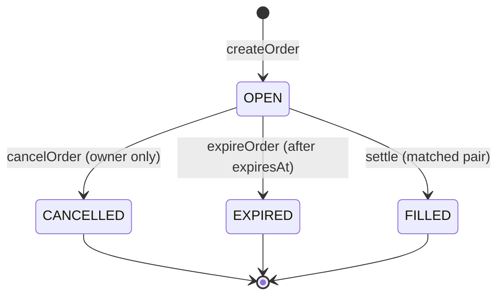

All states other than `OPEN` are terminal — every transition circuit asserts
the current state is `OPEN` before proceeding, so double-cancellation,
double-settlement, cancel-after-expiry, and expire-after-cancel are all
rejected. See ["Security"](#security) for the replay-protection layer
underneath this.

## Testing

Three independent, offline test suites — no devnet, proof server, or wallet
required for any of them — cover **284 tests** across the whole system:

```bash
npm run test                     # root: 60/60 — contracts/exchange.compact (34 order/settlement + 26 Treasury/PPM)
npm run test --workspace=matcher  # matcher: 205/205 — order book, matching, settlement, PPM, Treasury, API
cd web && npm run test            # web: 19/19 — commitment codec, formatting, order-status logic
```

| Suite | Tests | What it covers |
|---|---|---|
| **Root** (`tests/exchange.test.ts` + `tests/treasury.test.ts`) | 60 (34 + 26) | Drives the compiled circuits directly through `@midnight-ntwrk/compact-runtime`'s in-memory `CircuitContext`. `exchange.test.ts` covers `createOrder`/`getOrder`/`cancelOrder` positive and negative paths (including the owner-identity regression test for the audit's P0 finding), `settle`/`expireOrder` matching, mismatches, replay, atomicity, boundary values, and the **privacy invariant** test — asserting the ledger never leaks `amount`, `price`, `owner`, `asset`, `isBuy`, or `expiresAt`. `treasury.test.ts` covers admin-only enforcement on `depositTreasury`/`withdrawTreasury`, admin rotation (including the last-admin-cannot-be-removed guard), the full `reserveLiquidity` → `settleWithProtocol`/`releaseLiquidity`/`releaseExpiredLiquidity` lifecycle for both BUY and SELL, and rejection paths (insufficient balance, duplicate quote id, expired reservation, amount/asset mismatch, replay). |
| **Matcher** (`matcher/tests/`) | 205, >95% line coverage enforced | The in-memory order book, price-time-priority matching engine, SQLite persistence, settlement retry queue, REST/WebSocket API, commitment verification against on-chain state, and the PPM's `PricingEngine` (spread/inventory-skew quoting, risk-limit enforcement) and `PPMService` (quote → reserve → settle orchestration, BUY-only enforcement, expired-reservation sweep) — exercised with real SQLite (`:memory:`) and real matching/pricing logic; only the seams that face the live network (`SettleCircuitCaller`, `OnChainOrderReader`, `PpmCircuitCaller`, `OnChainTreasuryReader`) are faked. |
| **Web** (`web/tests/`) | 19 | The browser-side `OrderDetails` commitment codec (determinism and no-collision checks on the exact `persistentCommit` encoding a wallet must reproduce bit-for-bit) and the pure formatting/order-status logic the UI renders from. |

```bash
npm run build                     # root: tsc --noEmit
npm run lint --workspace=matcher  # matcher: eslint
npm run build --workspace=matcher # matcher: tsc build
cd web && npm run lint            # web: eslint
cd web && npm run build           # web: production Next.js build
```

Latest verified results across all three packages: **TypeScript — clean**
(root, matcher, and web all typecheck with 0 errors), **Lint — clean**
(matcher and web both eslint-clean), **Production build — passing** (web's
Next.js production build succeeds, including the `/treasury` route).

**Coverage:** the matcher enforces >95% line/statement coverage in CI via
`npm run test:coverage` (`@vitest/coverage-v8`). The contract suite is
hand-rolled and assertion-based (boundary values chosen deliberately — type
maxima, zero bytes, equal-price crossing — not fuzzed); no property-based or
fuzzing harness exists in this project today.

## CI/CD

[`.github/workflows/ci.yml`](./.github/workflows/ci.yml) runs on every push
to `main` and every pull request, split into **four independent jobs** so
each package reports its own pass/fail status instead of one monolithic
check:

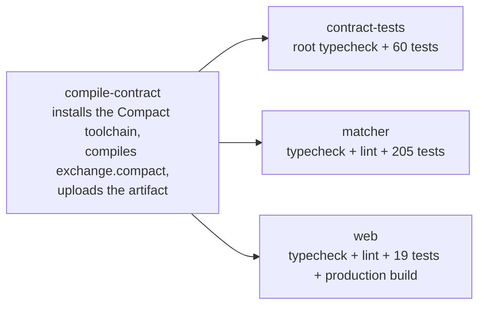

Root, matcher, and web all statically import types from the compiled
`contracts/managed/exchange/contract/index.js` (`src/cli.ts`,
`matcher/src/index.ts`, `web/src/services/midnight/exchangeContract.ts`, and
more), so none of them can typecheck, test, or build without it. `compile-contract`
compiles the contract once and shares the output via
`actions/upload-artifact`/`download-artifact`; `contract-tests`, `matcher`,
and `web` then run **in parallel**, each downloading that artifact.

| Job | Steps |
|---|---|
| `compile-contract` | Install the pinned Compact toolchain (`compact update 0.31.1`) → `compact compile` → upload `contracts/managed/exchange` as an artifact |
| `contract-tests` | Download the artifact → `npm ci` (root) → `npm run build` (typecheck) → `npm run test` (60 tests: 34 order/settlement + 26 Treasury/PPM) |
| `matcher` | Download the artifact → `npm ci` (root) → `npm run typecheck --workspace=matcher` → `npm run lint --workspace=matcher` → `npm run test --workspace=matcher` (205 tests) |
| `web` | Download the artifact → `npm ci` (in `web/`) → `npm run typecheck` → `npm run lint` → `npm run test` (19 tests) → `npm run build` (production Next.js build) |

A compilation failure, a type error, a lint violation, a failing test, or a
broken production build in *any* job fails CI, and PR checks show exactly
which package broke rather than one opaque "build-and-test" status. There is
no separate deployment stage in this pipeline — contract deployment is a
manual, explicit step (`npm run setup`) documented in
["Smart Contracts"](#smart-contracts), not something CI performs
automatically.

## Security

Full findings, methodology, and verification log: **[`AUDIT.md`](./AUDIT.md)**.

### Summary

One **P0 critical authorization bypass** was found and fixed: `cancelOrder`
verified the caller's identity using `ownPublicKey()`, a witness function
with no cryptographic binding to the actual transaction signer — any party
that legitimately knows an order's committed details (which the Matcher
always does, since wallets disclose full order details to it for settlement)
could have forged `cancelOrder` on an order it does not own. No other P0/P1
issues were found. **Production Readiness Score: 10/10** as of the
2026-07-16 addendum, after both a fresh deployment past the fixed
`cancelOrder` verifier key and a live end-to-end verification pass on
Preprod (see [`Deployment.md`](./Deployment.md)).

**Scope note:** this audit predates the Treasury/PPM module (`AUDIT.md`
contains no mention of either) — its findings and 10/10 score cover the
order registry and `settle()` only. The Treasury/PPM trust model below
documents that module's own authorization design in the meantime; it has
not yet been through the same independent audit process.

### Treasury / PPM trust model

- **Non-custodial user trading** — unchanged by the Treasury's existence.
  Deposits into the Treasury are an explicit admin action
  (`depositTreasury`), never something a user's trade implicitly does; a
  user's own funds are never in Treasury custody.
- **Treasury-backed protocol liquidity** — every PPM fill is backed 1:1 by a
  real balance in `treasuryBalances`; see ["Proactive Market Maker (PPM)"](#proactive-market-maker-ppm).
- **Reservation-based accounting** — liquidity is always `reserveLiquidity()`'d
  before it can be used and finalized via `settleWithProtocol()` or
  `releaseLiquidity()`/`releaseExpiredLiquidity()` afterward; `available`
  (`balance − reserved`) is computed live, never a separately-tracked figure
  that could drift out of sync.
- **On-chain settlement** — `settleWithProtocol` is a real circuit call with
  a real transaction id, exactly like `settle()`; there is no off-chain-only
  notion of a "protocol fill."
- **Admin-controlled Treasury operations** — `depositTreasury`,
  `withdrawTreasury`, `addAdmin`, and `removeAdmin` are the only
  admin-gated circuits in the contract; every other Treasury/PPM circuit
  (`reserveLiquidity`, `releaseLiquidity`, `releaseExpiredLiquidity`,
  `settleWithProtocol`) intentionally has no caller-identity check, at the
  same trust level as `settle()` itself — gated only by the state machine
  and the actual on-chain balance, not by who submits the transaction.
- **BUY-side-only protocol liquidity in MVP** — see
  ["Proactive Market Maker (PPM)"](#proactive-market-maker-ppm)'s MVP
  limitation section for why, and why it's a deliberate scope boundary
  rather than an oversight.
- **Comprehensive contract, backend and frontend test coverage** — 26
  dedicated contract-level Treasury tests (`tests/treasury.test.ts`) plus
  Matcher-level `PricingEngine`/`PPMService` unit and integration tests (see
  ["Testing"](#testing)) exercise this module to the same standard as the
  rest of the system.

### Replay protection

Two independent layers:

1. **State machine (primary).** `OPEN → FILLED` is one-way; no circuit ever
   transitions an order out of a terminal state. A replayed `settle()` on an
   already-filled pair fails before touching anything else.
2. **`settledPairs` nullifier set (defense-in-depth).** A hash of
   `[buyId, sellId]` in positional order, inserted before a pair can settle.
   Provably redundant with (1) under the current circuit set — kept as
   insurance against a future circuit that could re-open an order without
   going through the same state-transition path.

### Commitment verification

The contract's sole authentication primitive is
`persistentCommit<OrderDetails>(details, blinding) == commitment` — a hash
preimage proof, never a signature scheme. Only a party that actually knows an
order's true `(OrderDetails, blinding)` pair can produce a value that
recomputes to a given on-chain commitment. The Matcher independently
reimplements this same recomputation off-chain
([`orderDetailsCodec.ts`](./matcher/src/utils/orderDetailsCodec.ts)) and
requires it to match **both** the client-supplied commitment **and** the one
already recorded on-chain before trusting a disclosed order.

### Witness validation

Witness functions (`orderDetails`, `orderBlinding`, `ownerSecretKey`) are
supplied by whichever party's frontend is calling the circuit — the contract
never trusts a witness's return value as an identity signal on its own. This
is exactly the class of bug the P0 finding was: `ownPublicKey()` is also a
witness function, and using it directly for authorization let any prover
supply an arbitrary value. The fix replaces it with
`deriveOwnerId(ownerSecretKey())`, a **hash-commitment-based** identity check
the caller cannot forge without the real secret — the same pattern Midnight's
own reference contracts (zk-loan, battleship, bboard, private-party) use for
this purpose.

### Authorization

| Circuit | Mechanism |
|---|---|
| `createOrder` | None — intentional; a commitment carries no privilege until its contents are revealed. |
| `getOrder` | None — public read. |
| `cancelOrder` | `deriveOwnerId(ownerSecretKey()) == details.owner` — the audit's fix. |
| `expireOrder` | Time-based (`blockTimeGte`), correctly not identity-gated — expiry is a public fact. |
| `settle` | Commitment verification (proof of knowledge of both orders) + business-rule asserts; intentionally no caller-identity check, since `settle` is meant to be callable by the Matcher on behalf of two other parties. |
| `addAdmin` / `removeAdmin` | `requireAdmin()` — `deriveAdminId(adminSecretKey())` must be in the on-chain `admins` set. |
| `depositTreasury` / `withdrawTreasury` | Admin-only (`requireAdmin()`). The only circuits that move Treasury balance in/out of the contract. |
| `reserveLiquidity` / `releaseLiquidity` / `releaseExpiredLiquidity` / `settleWithProtocol` | No caller-identity check (same trust level as `settle`), except `releaseExpiredLiquidity`'s implicit time gate (`blockTimeGte`) — gated by the state machine and actual available balance, not by who submits the transaction; meant to be callable by the Matcher's PPM component on behalf of a resting user order. |

### Responsible disclosure

This project does not yet have a formal `SECURITY.md` or dedicated security
contact. If you find a vulnerability, please open a
[GitHub Security Advisory](https://github.com/wolf1276/ZEKURA/security/advisories/new)
on this repository (private by default) rather than a public issue, so a fix
can land before public disclosure.

### Known limitations (accepted, documented risks)

| ID | Risk | Status |
|---|---|---|
| P2-1 | `orderId` squatting / front-running griefing — `createOrder` binds no relationship between `orderId` and the (still-private) owner, so an observer who predicts an `orderId` can front-run it with a garbage commitment, permanently occupying that ID. No funds or existing orders at risk. | Accepted — closing it in-contract would require revealing part of the owner's identity in the clear at creation time. Recommended off-chain mitigation: derive `orderId` unpredictably and bound to the owner (`persistentHash(deriveOwnerId(secret), freshNonce)`). |
| P3-1 | `settle`/`expireOrder` place no bound on `expiresAt` — a wallet can commit to an order that never expires or expires immediately. Only affects the order's own owner. | Accepted — flagged for wallet-side input validation. |
| P3-2 | Commitment/blinding-factor hygiene is unenforceable on-chain — a buggy or malicious wallet that reuses a blinding factor across two orders with identical contents produces linkable commitments. | Accepted — a wallet-implementation requirement, not fixable in-contract. |
| P3-3 | `getOrder` costs a full transaction for a public read that's available for free from the indexer. | Informational — `getOrder` is a scoped deliverable; the frontend should prefer the indexer for reads. |
| P3-4 | PPM protocol-liquidity fills only support the BUY side; a resting SELL order never receives a protocol fill, only a user counterparty. | **Accepted, explicit MVP decision, not a bug** — see ["Proactive Market Maker (PPM)"](#proactive-market-maker-ppm). Requires a secure multi-asset custody/escrow leg to close; tracked in ["Roadmap"](#roadmap). |
| P3-5 | `AUDIT.md`'s independent security review predates the Treasury/PPM module and does not cover `depositTreasury`/`withdrawTreasury`/`reserveLiquidity`/`releaseLiquidity`/`releaseExpiredLiquidity`/`settleWithProtocol`/`addAdmin`/`removeAdmin`. | Informational — see the Treasury/PPM trust model above for that module's own (unaudited) design rationale; a follow-up audit pass covering it is tracked in ["Roadmap"](#roadmap). |

## Performance

Zekura's performance-relevant design decisions, in order of how directly
they affect trade latency:

- **The order book is never scanned wholesale.** `OrderBook` is
  `Map<assetKey, AssetBook>`; each `AssetBook` holds one sorted `Bucket` per
  side (best price first for that side, FIFO within a price level for time
  priority). Every operation is O(1) or bounded to one asset's one bucket —
  `add`, `has`, `remove`, `oppositeBucket` never touch unrelated assets or
  the opposite side's book.
- **Matching is event-driven, not polled.** `MatchingEngine.onOrderArrived`
  runs only when a new order arrives or an existing one is removed — there
  is no timer, no poller, no periodic re-scan. `PriceTimePriorityStrategy`
  walks the opposite bucket's natural best-first order and stops at the
  first non-crossing price level, since sorted iteration guarantees nothing
  worse could match either.
- **Claims are atomic without locking overhead.** The Matcher is a single
  Node.js process; the claim step (verify both orders still `OPEN`, flip to
  `MATCHED`, insert the match row) runs inside one synchronous
  `better-sqlite3` transaction with no `await` in between — JavaScript's
  single-threaded event loop guarantees no other request can interleave, so
  there's no distributed lock or CAS retry loop needed for the common case.
  `OrderRepository`'s `PRIMARY KEY` constraint is the actual source of truth
  for duplicate-id detection; the `exists()` pre-check is only a fast path.
- **Settlement never blocks matching.** `SettlementQueue` is a per-key
  single-flight retry queue — a match's `settle()` submission and retries
  run independently of the order book, so a slow or retrying settlement
  cannot stall new orders from being accepted or matched.
- **Reads that don't need a proof are free.** The Matcher verifies
  commitments against the indexer (a public GraphQL read), never a paid
  `getOrder()` transaction — this keeps order submission latency dominated
  by proof generation and chain confirmation, not by extra on-chain reads.
- **Settlement retry uses linear backoff with a bounded budget**
  (`MATCHER_SETTLEMENT_MAX_RETRIES`, default 5; `MATCHER_SETTLEMENT_RETRY_DELAY_MS`,
  default 5000ms), and `SettlementService.recoverPendingSettlements()`
  re-enqueues any match still `MATCHED`/`SETTLING` after a process restart —
  so a Matcher crash mid-settlement doesn't silently drop a match; it
  resumes from the DB, the durable record of what's still outstanding.

### Concurrency and scale

The current architecture is a **single-process Matcher** — correct and fast
for one operator's order book (bounded, sorted, in-memory structures; a
single synchronous SQLite writer), but not yet horizontally scaled. See
["Roadmap"](#roadmap) for what a multi-instance Matcher would require
(a shared order book / leader-election for settlement submission, since
`settle()` must never be double-submitted for the same match).

### Future optimizations

- Batched/parallel proof generation for concurrent order submissions.
- A dedicated read-replica or candle/history table for `/stats`, which today
  computes on read from persisted matches on every request.
- Horizontal Matcher scaling (see above) once order volume exceeds a single
  process's throughput.

## Roadmap

This roadmap is grounded in what the audit, deployment record, and code
already flag as open work — not speculative feature ideas.

### Near-term

- **A literal wallet-extension click-through.** Every code path the demo
  flow exercises has been driven directly (same SDK calls, same providers)
  or covered by the 284 automated tests, and the production build renders
  every route cleanly — but a real browser session with a funded 1AM/Lace
  wallet performing the actual approval pop-up flow has not yet been
  recorded (see [`Deployment.md`](./Deployment.md)'s "Not yet exercised" notes).
- **Redeploy Preview with the Treasury/PPM build.** Preview is stale (still
  the pre-Treasury 5-circuit build) — see ["Smart Contracts"](#smart-contracts).
  The same staged-deploy process already used for Preprod applies directly.
- **Off-chain mitigations for the audit's accepted risks** (P2-1 `orderId`
  squatting, P3-1 unbounded `expiresAt`, P3-2 blinding-factor hygiene) —
  wallet-side input validation and unpredictable `orderId` derivation.
- **A formal `SECURITY.md` and `CONTRIBUTING.md`** — neither exists in this
  repository yet; see ["Contributing"](#contributing) and ["Security"](#security).

### Mid-term

- **SELL-side PPM protocol liquidity.** Requires a secure multi-asset
  custody/escrow leg so a user's asset can be taken as a transaction input
  during `settleWithProtocol` — intentionally out of scope for the MVP; see
  ["Proactive Market Maker (PPM)"](#proactive-market-maker-ppm).
- **An independent audit pass covering the Treasury/PPM module** —
  `AUDIT.md`'s existing review predates it (see ["Security"](#security)'s
  scope note); `depositTreasury`/`withdrawTreasury`/`reserveLiquidity`/
  `releaseLiquidity`/`releaseExpiredLiquidity`/`settleWithProtocol`/
  `addAdmin`/`removeAdmin` have not yet been through the same process as the
  order registry and `settle()`.
- **Horizontal Matcher scaling** for order volume beyond a single process
  (see ["Performance"](#performance)).
- **A dedicated stats/candle store** to avoid recomputing `/stats` from raw
  matches on every request.
- **Additional wallet integrations** beyond 1AM and Lace, as more DApp
  Connector-compatible wallets reach the Midnight ecosystem.

### Long-term

- **Mainnet.** Out of scope today — no Mainnet `NetworkConfig` exists in
  this repo (`src/network.ts`/`web/src/network/networkConfig.ts` define only
  `preview`/`preprod`). Adding it is intentionally isolated to one new entry
  in `networkConfig.ts` per that file's own documentation.
- **A published whitepaper, hosted app deployment, and demo video** — none
  exist yet (see ["Live Demo"](#live-demo)).

## Contributing

There is no formal `CONTRIBUTING.md` in this repository yet — this section
describes the de facto workflow enforced by CI today.

### Development workflow

1. Fork and clone the repository, then follow ["Getting Started"](#getting-started).
2. Make changes in the relevant package (`contracts/`, `matcher/`, or `web/`).
3. Before opening a PR, run the same checks CI runs for the package(s) you touched:
   ```bash
   npm run compile && npm run build && npm run test              # root / contract
   npm run typecheck --workspace=matcher && npm run lint --workspace=matcher && npm run test --workspace=matcher
   cd web && npm run typecheck && npm run lint && npm run test && npm run build
   ```
4. Open a pull request against `main`. Every push and PR is gated by
   [`.github/workflows/ci.yml`](./.github/workflows/ci.yml) — see ["CI/CD"](#cicd).

### Coding standards

- TypeScript throughout, `tsc --noEmit`/`next typegen && tsc --noEmit` clean.
- ESLint clean for `matcher/` and `web/` (`eslint.config.js`/`eslint.config.mjs`).
- No linter is configured for the root package or the Compact contract
  itself — contract changes are reviewed against `AUDIT.md`'s documented
  security model and the existing regression suite in `tests/exchange.test.ts`.
- New behavior should come with a test in the corresponding suite
  (`tests/`, `matcher/tests/`, or `web/tests/`) — the matcher enforces >95%
  line coverage in CI.

### Branch naming and commit conventions

This repository's own commit history uses a loose
`type(scope): summary` convention (e.g. `feat(trade): ...`,
`fix(ci): ...`, `docs(readme): ...`) — follow that pattern for consistency,
though it is not currently enforced by a commit-lint tool.

### Pull request process

Open a PR against `main`; CI must pass (compile, typecheck, lint, test, and
a production build for `web`) before merge. Any change to
`contracts/exchange.compact` that alters a circuit's logic changes its
verifier key — call this out explicitly in the PR description, since it
requires a fresh deployment (see ["Smart Contracts"](#smart-contracts)).

## Documentation

| Document | Covers |
|---|---|
| [`matcher/README.md`](./matcher/README.md) | Matcher quick start, tech stack, project layout |
| [`matcher/ARCHITECTURE.md`](./matcher/ARCHITECTURE.md) | Component responsibilities, request flow, database schema, security & concurrency model |
| [`matcher/API.md`](./matcher/API.md) | Full REST/WebSocket API reference |
| [`matcher/MATCHER.md`](./matcher/MATCHER.md) | Matching algorithm and settlement lifecycle in depth |
| [`web/README.md`](./web/README.md) | Next.js app basics |
| [`AUDIT.md`](./AUDIT.md) | Full security audit — findings, fixes, verification log |
| [`Deployment.md`](./Deployment.md) | Deployment history and live end-to-end verification record on Preview/Preprod |
| [`contracts/exchange.compact`](./contracts/exchange.compact) | The contract source itself — heavily commented, the ground truth for circuit behavior |
| [Midnight developer documentation](https://docs.midnight.network/) | Compact language reference, DApp Connector API, network architecture |

There is no separately published whitepaper or hosted API-docs site for
Zekura today — `AUDIT.md` and the `matcher/*.md` files above serve that role
for now.

## FAQ

**Which wallets does Zekura support?**
Any wallet implementing the Midnight DApp Connector API. 1AM and Lace are
recognized by name; see ["Wallet Setup"](#wallet-setup).

**Why does Lace need a local proof server but 1AM doesn't?**
1AM implements `getProvingProvider()` (in-browser proving); Lace doesn't, so
Zekura falls back to a local proof server (`NEXT_PUBLIC_PROOF_SERVER_URL`,
default `http://127.0.0.1:6300`) for Lace sessions only.

**Does Zekura ever see my private keys or hold my funds?**
No. Zekura is non-custodial — wallets sign and submit their own
`createOrder`/`cancelOrder` transactions directly. The Matcher only submits
`settle()`/`settleWithProtocol()` for orders it has independently verified
against the chain, and never holds an order's `ownerSecretKey`. This applies
equally to PPM fills — the Treasury the PPM draws on is protocol-owned
liquidity, never a user's funds.

**What is the PPM, and where does its liquidity come from?**
The Proactive Market Maker is the Matcher's fallback for a resting order
that finds no user counterparty — it fills the order out of the Treasury,
the contract's own protocol-owned liquidity pool, funded only by real admin
deposits. It never mints or fabricates liquidity; see
["Proactive Market Maker (PPM)"](#proactive-market-maker-ppm) and
["Treasury"](#treasury).

**Does the PPM support both buy and sell orders?**
Not yet. User↔user matching supports both sides; PPM fills are currently
BUY-side only, because the SELL side would require the Treasury to receive
a user's asset as part of the settlement transaction, which needs a secure
multi-asset custody/escrow leg this MVP doesn't yet have. This is an
explicit design decision, not a bug — see
["Proactive Market Maker (PPM)"](#proactive-market-maker-ppm)'s MVP
limitation section.

**What exactly stays private, and what becomes public?**
See ["Privacy Model"](#privacy-model) — in short, only a commitment and a
lifecycle state are ever on-chain; asset, amount, side, price, owner, and
expiry never are.

**Can the Matcher cancel my order?**
No — structurally cannot. `cancelOrder` requires the owner's
`ownerSecretKey` witness, which the Matcher is never disclosed. `DELETE
/orders/:id` on the Matcher only removes an order from its own book/database;
it never submits an on-chain `cancelOrder()`. See ["Security"](#security).

**How does settlement work without revealing order details?**
`settle(buyOrderId, sellOrderId)` takes no order data as arguments — it
re-derives both orders' private details from witnesses supplied by the
caller and proves, in zero knowledge, that they satisfy the crossing rules
(same asset, same amount, `buyPrice >= sellPrice`, distinct owners), without
disclosing those values on-chain.

**Which networks does Zekura support?**
Preview and Preprod, both public Midnight testnets, plus a local devnet via
Docker Compose. Preprod is the default. Mainnet is out of scope today — see
["Roadmap"](#roadmap).

**Is there partial fill support?**
No — `settle()` requires exact amount equality between the buy and sell
order; the matching engine skips any candidate whose amount doesn't exactly
match (see [`matcher/MATCHER.md`](./matcher/MATCHER.md)).

**Has this been audited?**
Yes — see [`AUDIT.md`](./AUDIT.md). One P0 finding (an authorization bypass
in `cancelOrder`) was found and fixed; production readiness score 10/10
after a live end-to-end verification pass on Preprod. That audit predates
the Treasury/PPM module, though — see ["Security"](#security)'s scope note.

## License

[MIT](./LICENSE) © 2026 Zekura.

## Acknowledgements

- **[Midnight Network](https://docs.midnight.network/)** — the data-protection
  blockchain, Compact language, and `midnight-js-*`/wallet SDK stack Zekura
  is built entirely on.
- **Open source libraries** that make up the stack: [Fastify](https://fastify.dev/),
  [better-sqlite3](https://github.com/WiseLibs/better-sqlite3), [Zod](https://zod.dev/),
  [pino](https://getpino.io/), [Next.js](https://nextjs.org/), [React](https://react.dev/),
  [Tailwind CSS](https://tailwindcss.com/), [shadcn/ui](https://ui.shadcn.com/),
  [Radix UI](https://www.radix-ui.com/), [Vitest](https://vitest.dev/), and
  the rest listed in [`package.json`](./package.json), [`matcher/package.json`](./matcher/package.json),
  and [`web/package.json`](./web/package.json).
- **Contributors** — see the [contributor graph](https://github.com/wolf1276/ZEKURA/graphs/contributors).
